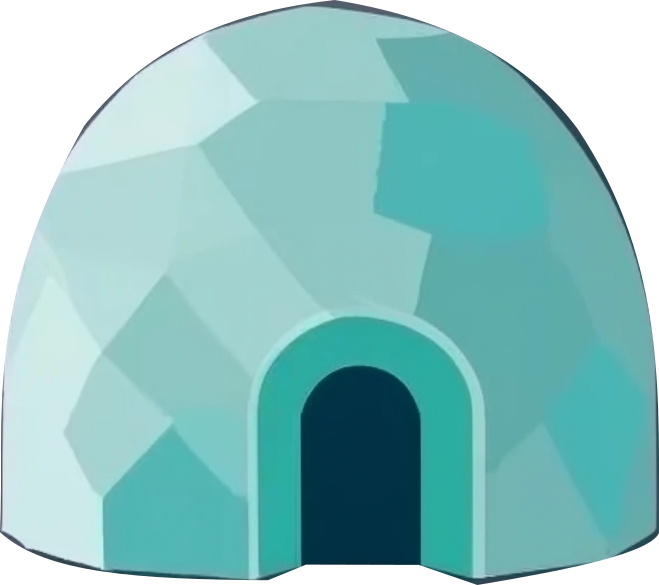
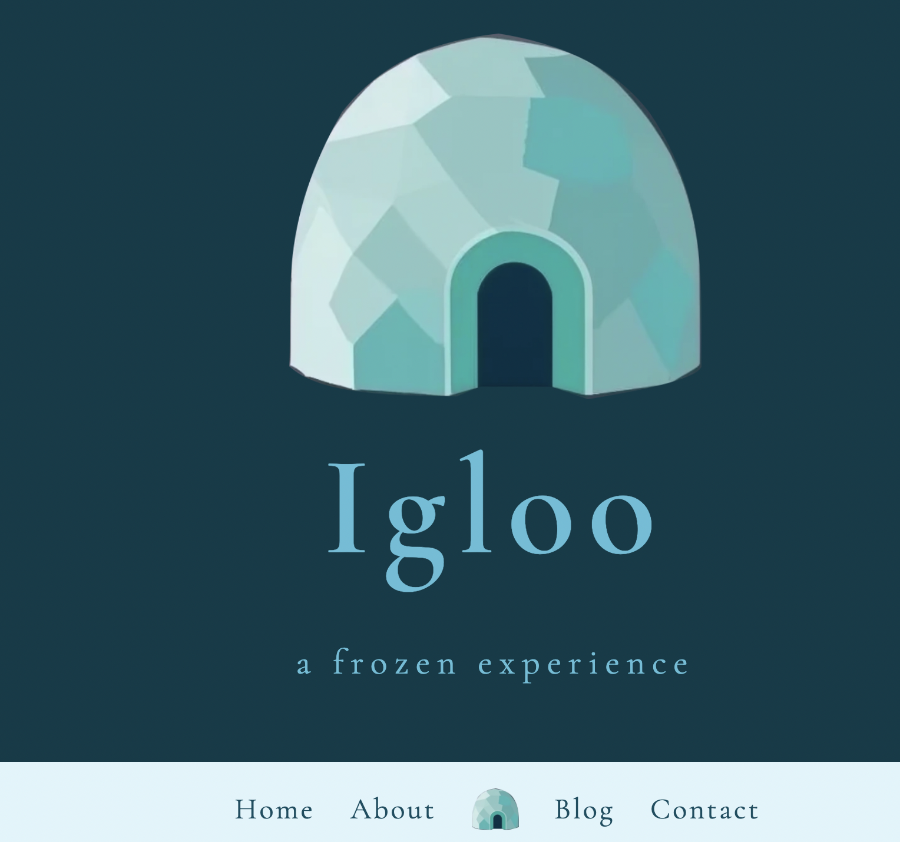
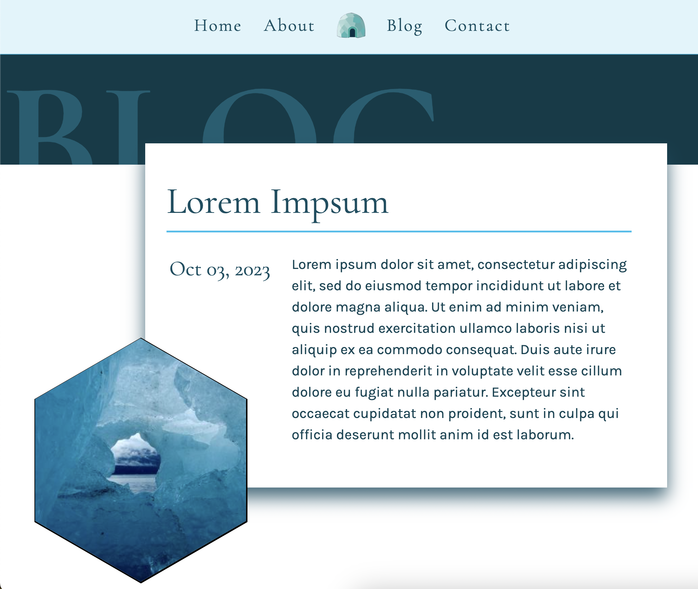

# Hugo Igloo

This is a template for creating a website theme for the [Hugo](https://gohugo.io/) static site generator.

## Getting Started

To get started, clone this repository and modify the files in the `layouts` and `static` directories to create your own custom theme.

### Your own favicon

Having an icon sumbolising your webpage is an important factor for modern websites.
To add yout own, use the [realfavicongenerator](https://realfavicongenerator.net/)
to generate icons. Download your icon bundle,
and place replace `static/favicon/` with the extracted folder.

## Usage

To use your custom theme with Hugo, copy the theme directory to the `themes` directory of your Hugo site. Then, set the `theme` parameter in your site's configuration file to the name of your custom theme.

## Contributing

If you find a bug or have a feature request, please open an issue on the [GitHub repository](https://github.com/drmowinckels/hugo-igloo). Pull requests are also welcome!

## License

This project is licensed under the [MIT License](LICENSE).
